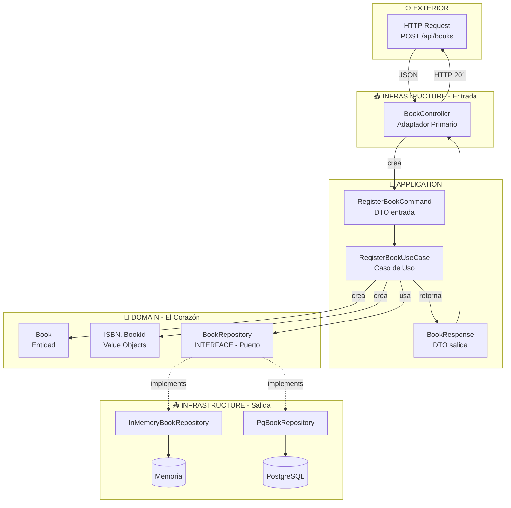
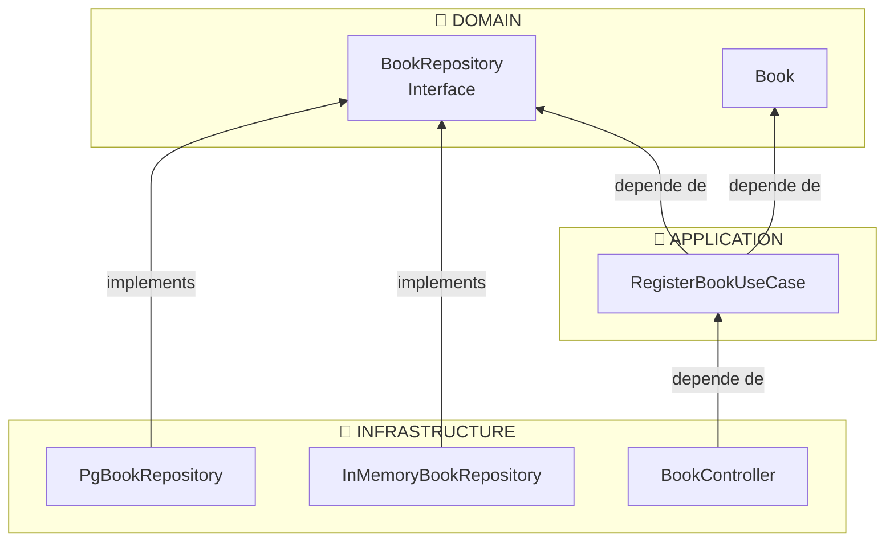
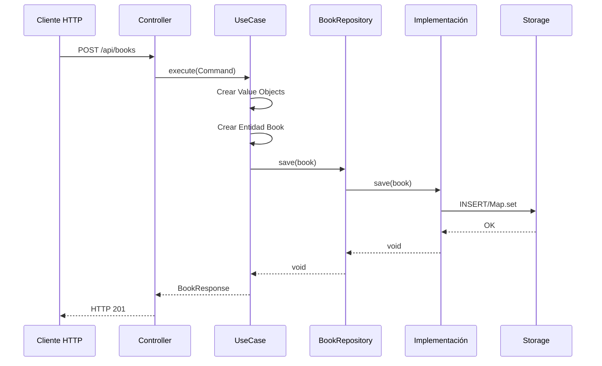
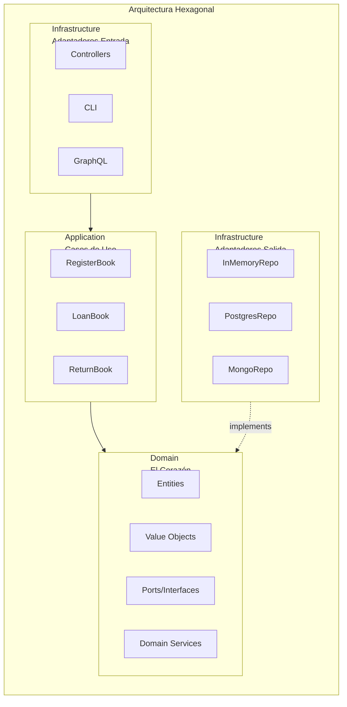

# Diagramas del Patrón Repository

Diagramas Mermaid que ilustran el flujo completo y la inversión de dependencias en el patrón Repository.

---

## 1. Flujo Completo de una Petición

Este diagrama muestra el recorrido completo de una petición HTTP desde que llega hasta que se persiste en la base de datos.



### Explicación del Flujo

1. **Cliente** envía HTTP Request con JSON
2. **Controller** (Infrastructure) recibe y crea el Command (DTO)
3. **UseCase** (Application) orquesta la lógica:
   - Crea Value Objects (ISBN, BookId)
   - Crea la Entidad Book
   - Usa el Puerto (Interface) para persistir
4. **Repository Interface** (Domain) define el contrato
5. **Implementación** (Infrastructure) ejecuta la persistencia real
6. La respuesta vuelve por el mismo camino

---

## 2. Inversión de Dependencias

Este diagrama muestra cómo las dependencias apuntan HACIA el dominio (inversión).



### La Clave de la Inversión

**Sin inversión (mal):**
```
Application ──depende de──▶ Infrastructure (PostgreSQL)
```

**Con inversión (bien):**
```
Application ──depende de──▶ Domain (Interface)
                                  ▲
                                  │ implements
                            Infrastructure
```

**Observa:**
- Las flechas van de abajo hacia arriba (hacia el dominio)
- `InMemoryBookRepository` y `PgBookRepository` **implementan** la interface
- `RegisterBookUseCase` **solo conoce** la interface, no las implementaciones
- El dominio **no depende de nadie**

---

## 3. Diagrama de Secuencia

Este diagrama muestra la secuencia temporal de una petición para registrar un libro.



### Pasos Detallados

| Paso | Componente | Acción |
|------|------------|--------|
| 1 | Cliente | Envía POST con JSON `{isbn, title, author}` |
| 2 | Controller | Crea `RegisterBookCommand` y llama al UseCase |
| 3 | UseCase | Crea `ISBN` y `BookId` (Value Objects) |
| 4 | UseCase | Crea entidad `Book` con validaciones |
| 5 | UseCase | Llama a `bookRepository.save(book)` |
| 6 | Interface | Delega a la implementación inyectada |
| 7 | Implementación | Persiste en memoria o PostgreSQL |
| 8 | Respuesta | Vuelve por el mismo camino |

---

## 4. Capas y Responsabilidades



---

## Archivos Relacionados

| Diagrama | Archivos del Proyecto |
|----------|----------------------|
| Controller | `src/infrastructure/controllers/rest/book.controller.ts` |
| DTO/Command | `src/application/dtos/book.dto.ts` |
| UseCase | `src/application/use-cases/register-book.use-case.ts` |
| Interface (Puerto) | `src/domain/repositories/book.repository.ts` |
| Entidad | `src/domain/entities/book.ts` |
| Impl. InMemory | `src/infrastructure/persistence/in-memory/in-memory-book.repository.ts` |
| Impl. PostgreSQL | `src/infrastructure/persistence/postgresql/pg-book.repository.ts` |

---

## Ver También

- [GUIA_REPOSITORY_PATTERN.md](./GUIA_REPOSITORY_PATTERN.md) - Guía completa del patrón
- [README.md](./README.md) - Índice de documentación
